Most of what the twentieth century believed about how people should live was tried in Berlin, and nearly all of it left a building behind. An empire, a republic, a dictatorship, two states facing each other across a wall, then one country again: the city still lives in what each of them built. This summer I spent three weeks there on a study abroad course led by Peter Sealy, working through its history, architecture and culture in analog film and photography, which is how the century watched itself. These are fifteen of the photographs, and what I thought while taking them.

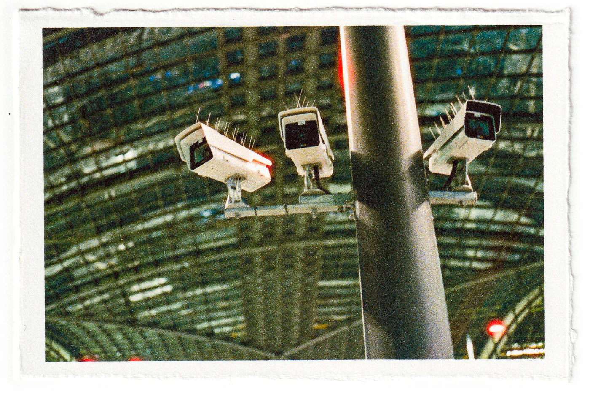

Berlin watches and hates being watched. Police walk the streets in threes and nobody looks up from their phone, but raise a camera and faces turn to find the lens before you have focused. The city keeps the files its secret police wrote on its own citizens, open to anyone who books a tour, and still the offense that registers is a stranger pointing something in your vicinity. Watched into paranoia once, it has settled on terms: the state may look, a person may not.

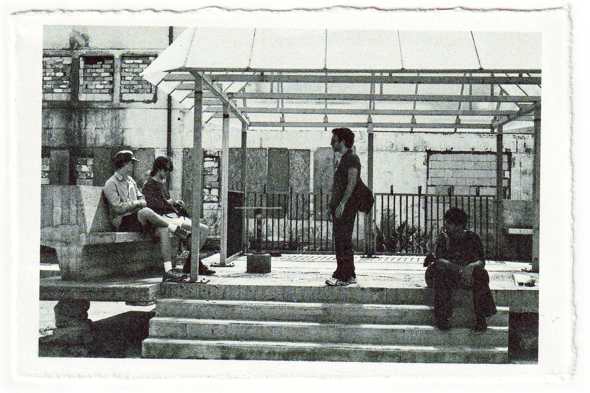

People warn you about the grey. You arrive braced for concrete and flat hard weather, and in places that is what you get, but August held, the light stayed on the face of every building until nearly ten, and the parks filled with people lying in it as though it were owed to them. Whatever I thought the city would be, I had metered it for grey.

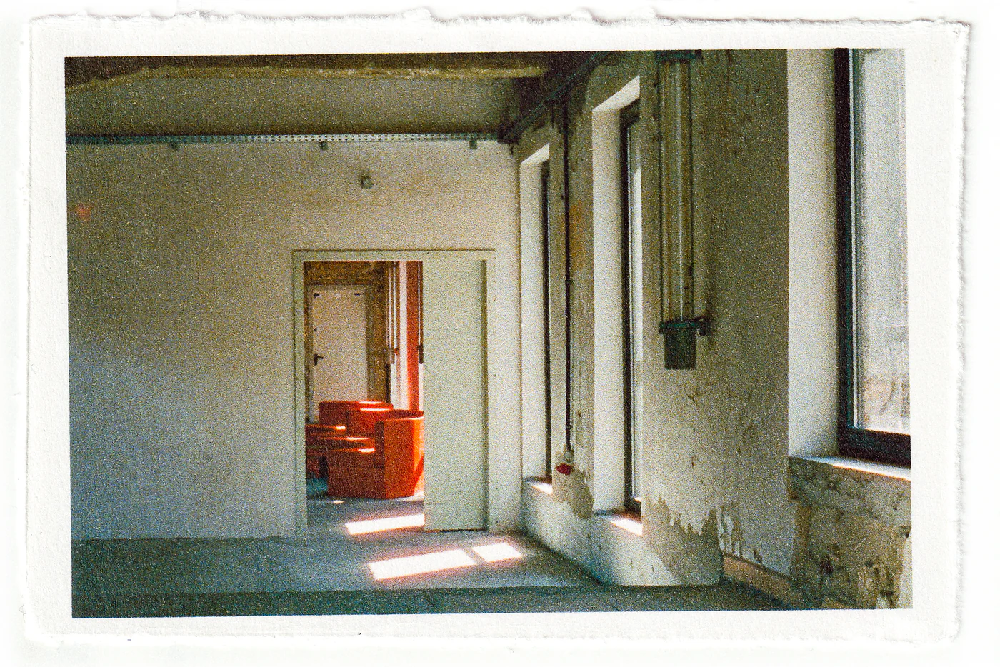

It keeps its wounds underfoot. Brass squares in the pavement outside the last home somebody chose for themselves. A double row of cobbles where the Wall stood, with cars parked across it. A pane of glass set into a square, and under it empty shelves with room for the twenty thousand books burned there. None of it asks for a detour. You cross it on the way to lunch and the day goes on, which is either what the design intends or what it costs.

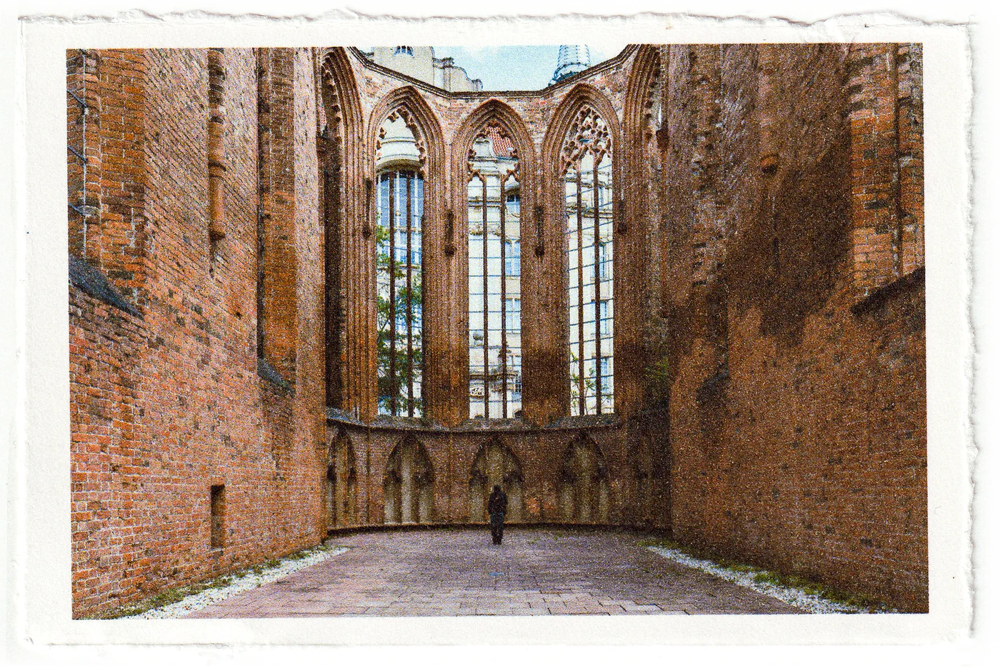

I kept taking the scars for sacred and then remembering that somebody designed them. A memorial is a commission like any other. Someone chose the stone and the typeface, someone priced it, a jury picked it over the other entries. Even a ruin left standing is a decision somebody signed. None of that is a debunking. It is what makes standing inside one strange, because knowing how the grief was built does not make it less grief.

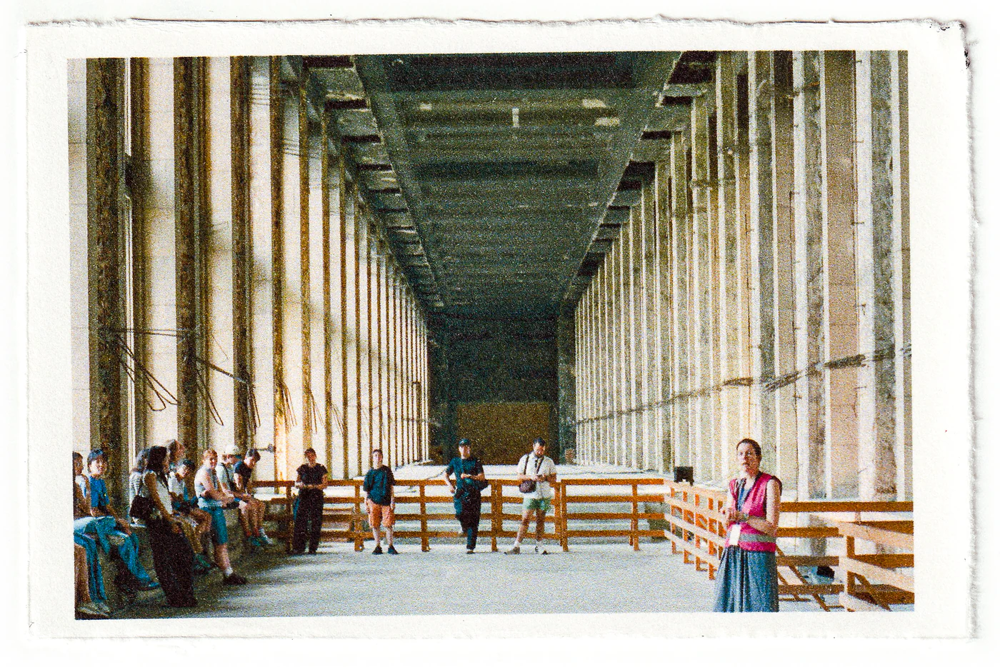

I took photographs I liked of buildings I should not like. Good light does not check the history of what it lands on, and some of those frames came back beautiful in a way I cannot separate from what was done behind the facade. The discomfort may be the only honest way to hold a camera here.

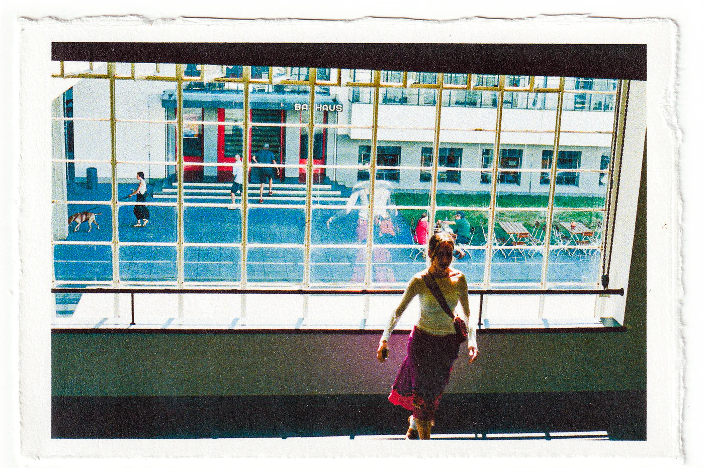

Berlin loves a surface, which is not the insult it sounds like. It loved the clean plane of the Bauhaus in the twenties, and it loves its cobbles and parks and long avenues now, enough to build them a second time.

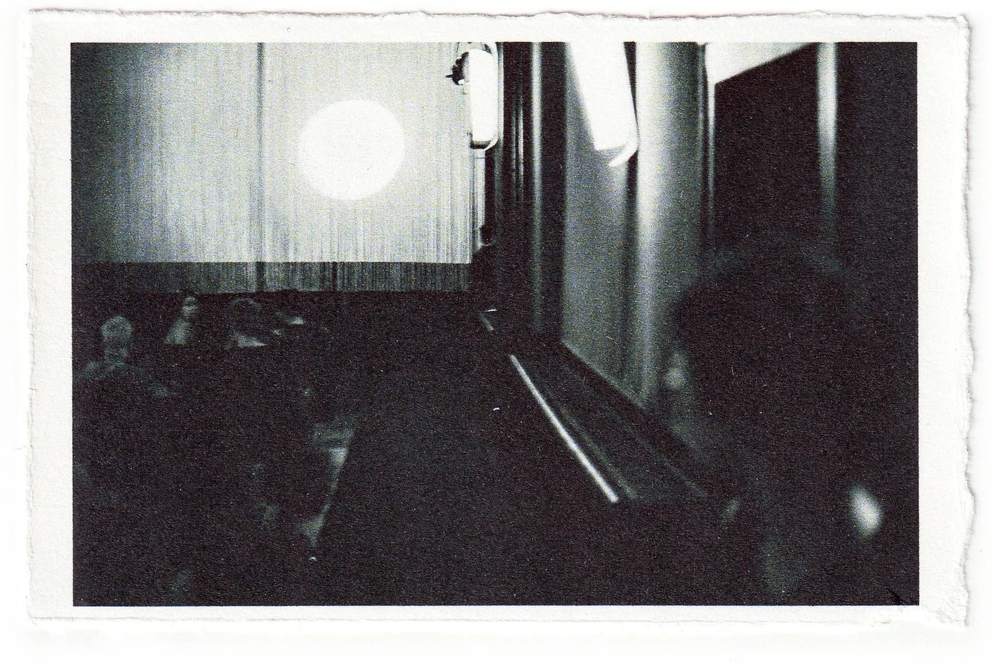

One plot in the middle of the city holds most of the century. The Kaiser's palace stood there until the war gutted it and East Germany blew up what was left, then put its own Palace of the Republic in its place. The reunified country pulled that down for being the wrong kind of history. Now the Kaiser's facade is back, rebuilt from old photographs and private donations and wrapped around a new museum. It would be easy to file this under nostalgia. Nearer the truth is that the city knows old beauty is useful, having watched a regime put it to use once already.

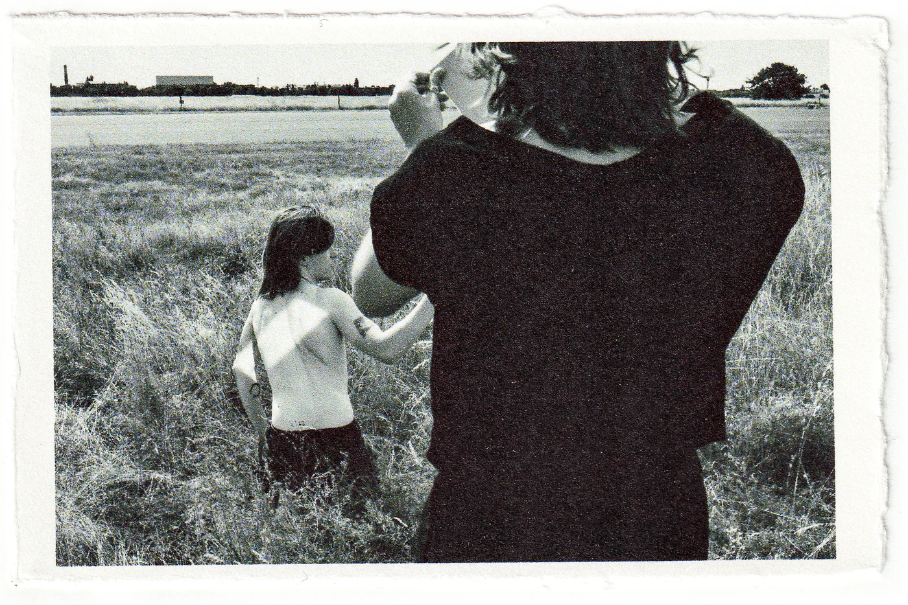

A visitor comes looking for ghosts and finds very few. Nobody flies the old flags; that argument is settled, and policed. What gets through is softer: a fondness for the beautiful parts of the past, which arrives looking like taste rather than politics.

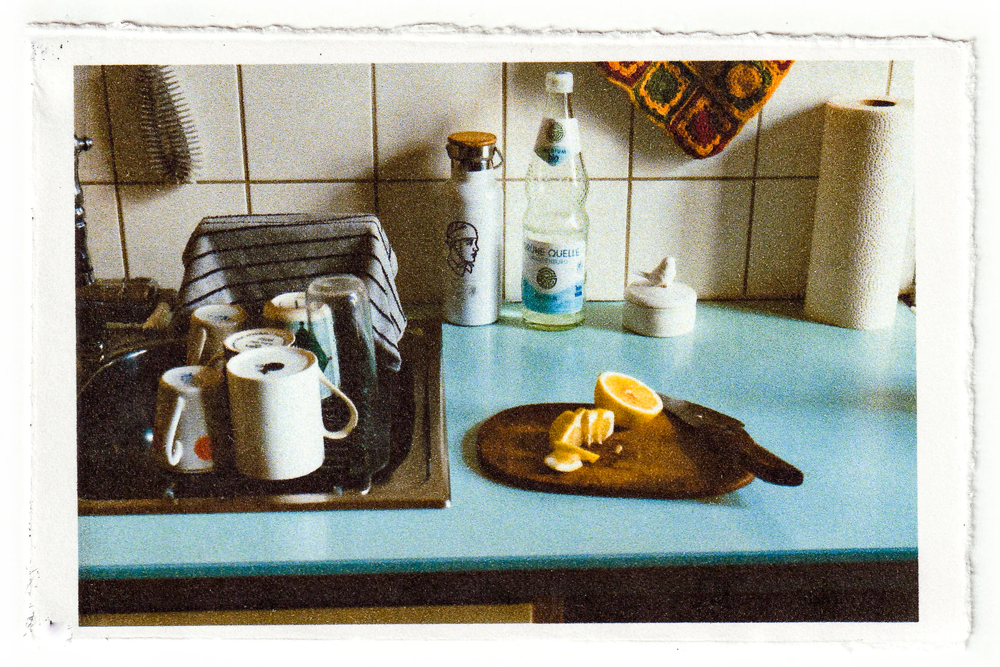

None of which explains why the beer costs less than the water.

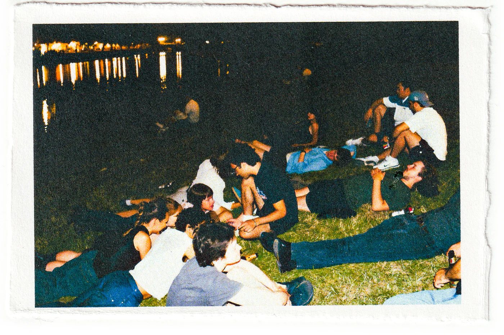

I had more fun than I have had in years. Some of that belongs to the course, to the teaching, and to the classmates, old friends and new, who walked every kilometre of it beside me.

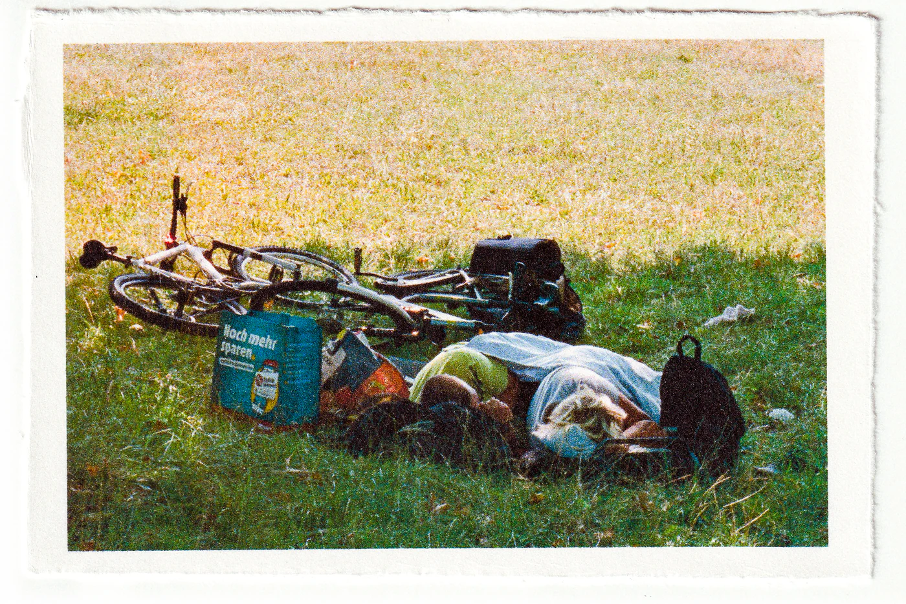

Most of it was more ordinary than that. Lying in the park with nothing to do. Beers from the Späti, drunk on the way to somewhere else. Pizza and vodka out of a juice box on the bridge, our legs through the railing next to everyone else's. Getting turned away at a door and laughing about it the whole way to the next one. Walks long enough that the edges of the day went grey. I smiled through all of it in a way I had almost forgotten I could.

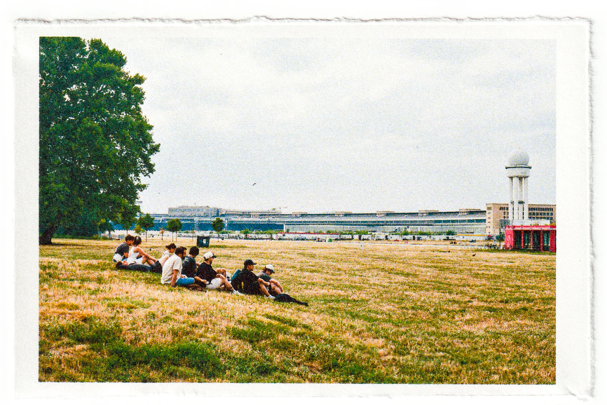

What I keep turning over is how easily the two sat together. You dance until the light comes back in a room the state built to broadcast propaganda at its own citizens, or in a bunker poured in the middle of the war. You lie in the grass between the runways of an airport a regime rebuilt while it made plans for the rest of the map. On Saturdays the stadium it built for its Olympics, and filmed for the world to watch, fills up and sings for ninety minutes. Nobody near me was working through any of this. Not denial so much as the arithmetic of living somewhere. The buildings outlasted their purposes, and people still need somewhere to be on a Friday.

The easy move is to list: concrete and green, old and new, punk and imperial. I wrote that list and no longer trust it. Pairs are what you reach for when you have had three weeks somewhere and need it to hold still for the exposure.

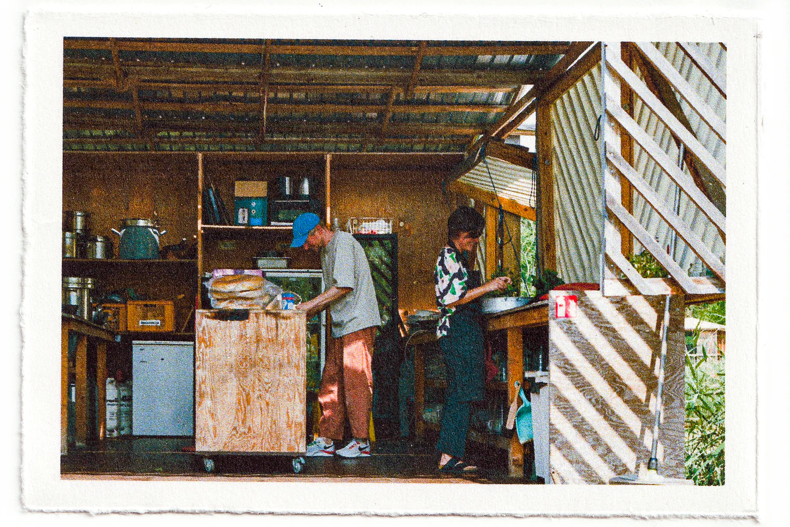

What I did not expect was how much got handed over. Architects who cooked for us and sat down to eat with us. People who opened their homes to students they would never see again. Filmmakers who put their own cameras in our hands, showed us how to load them, and let us walk out into their city with them.

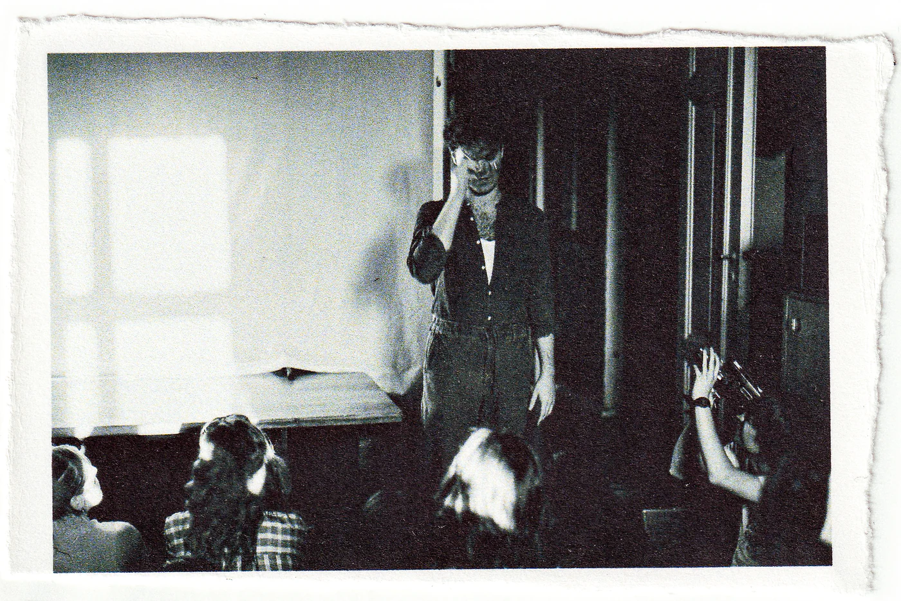

Berlin spent three weeks refusing to be looked at, and its people kept handing me things to look with. By the end it did not feel like a contradiction. It was the fine print on the city's terms: a person may look, if somebody here hands them the camera.

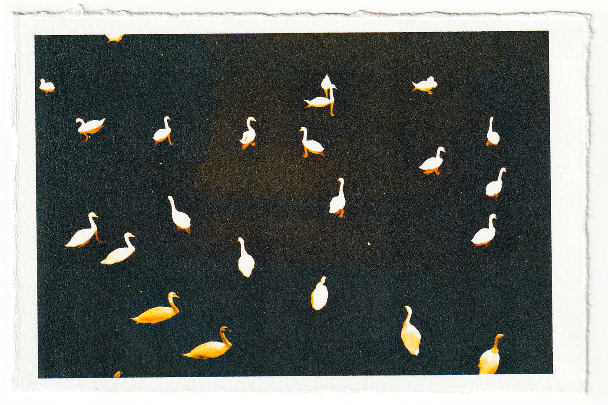

I went looking for the twentieth century and found it everywhere, down to the pavement. What I had not expected was a city still watching it, the way you keep an eye on something you survived. Some of that watching came out on the film. So did we, asleep in the grass, with the century standing over us.
